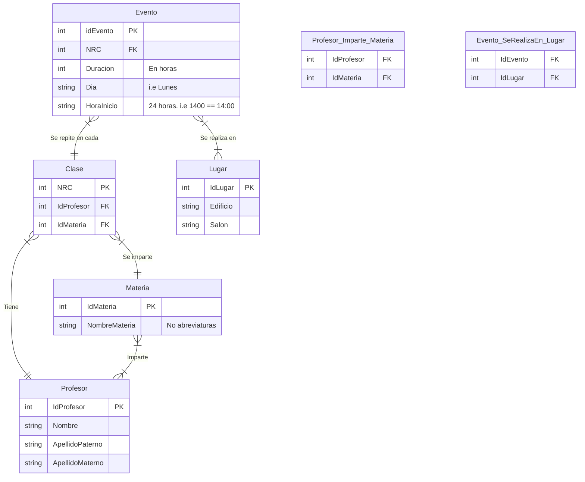

# CSV to sqlite3 database

## How to use

Create sqlite tables using `queries.sql`

```bash
sqlite3 horario.db '.read queries.sql'
```

Run script

```bash
python3 readcsv.py
```

You must rename your csv as `p2024` and following this guidelines.

### CSV Guidelines

> We recommend use google spreadsheets.

Columns

```
NRC,Clave,Materia,Secc,Días,Hora,Profesor,Salón,unnamed
```

- `Días` changes to `Dia`
- `Salón` to `Salon`
- Remove every `unnamed` column

You must got something like this:

```
NRC,Clave,Materia,Secc,Dia,Hora,Profesor,Salon
```

## Use Cases

Obtener todas las materias que se llevaran a cabo de forma virtual (CCO1V)

```sql
select NombreMateria from Materia where IdMateria in (
    select IdMateria from Clase where NRC in (
        select NRC from Evento where IdEvento in (
            select IdEvento from Evento_SeRealizaEn_Lugar where IdLugar in (
                select IdLugar from Lugar where Edificio like '%CCO1V%'
            )
        )
    )
);
```

**Result**:

```bash
Ingenieria de Software Avanzada
Interaccion Humano Computadora
Intercomunicacion y Seguridad en Redes
Introduccion a los Compiladores
Investigacion de Operaciones
Lenguajes de Programacion
Procesamiento Digital de Imagenes
Recuperacion de la Informacion
Sistemas de Tiempo Real
Tratamiento de la Informacion
Vision y Animacion por Computadora
Web Semantica
```

Todas las materias que impartirá un profesor (buscado por su apellido paterno)

```sql
select NombreMateria from Materia where IdMateria in (
    select IdMateria from Profesor_Imparte_Materia where IdProfesor in (
        select IdProfesor from Profesor where ApellidoPaterno like '%Colmenares%'
    )
);
```

**Result**:

```bash
DHPC
Formacion Humana y Social
Sistemas de Tiempo Real
```

## Entity Relationship Diagram


