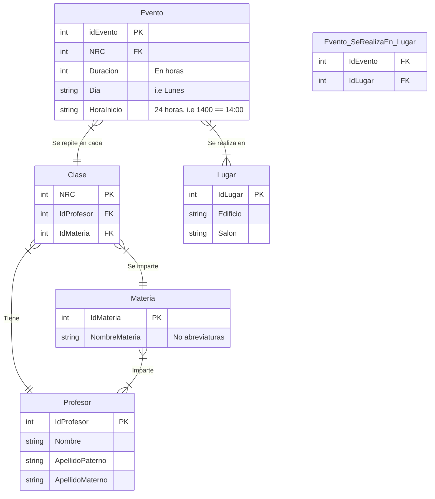

# CSV to sqlite3 database

## How to use

Create sqlite tables using `queries.sql`

```bash
sqlite3 horario.db '.read queries.sql'
```

Run script

```bash
python3 readcsv.py
```

You must rename your csv as `p2024` and following this guidelines.

### CSV Guidelines

> We recommend use google spreadsheets.

Columns

```
NRC,Clave,Materia,Secc,Días,Hora,Profesor,Salón,unnamed
```

- `Días` changes to `Dia`
- `Salón` to `Salon`
- Remove every `unnamed` column

You must got something like this:

```
NRC,Clave,Materia,Secc,Dia,Hora,Profesor,Salon
```

## Use Cases

Muestra el NRC, la duración, los dias y la hora en que se impartirá la clase de *inalambricas* y excluye a los profesores que su apellido materno sea *Beris*.

```sql
SELECT * 
FROM Evento 
WHERE NRC IN (
    SELECT NRC 
    FROM Clase 
    WHERE IdProfesor IN (
        SELECT IdProfesor 
        FROM (
            SELECT * 
            FROM Profesor 
            WHERE IdProfesor IN (
                SELECT IdProfesor 
                FROM Profesor_Imparte_Materia 
                WHERE IdMateria IN (
                    SELECT IdMateria 
                    FROM Materia 
                    WHERE NombreMateria LIKE '%inalambrica%'
                )
            )
        )
        WHERE ApellidoMaterno NOT LIKE '%Beris%'
    )
    AND 
    IdMateria IN (
        SELECT Idmateria 
        FROM Materia 
        WHERE NombreMateria 
        LIKE '%inalambrica%'
    )
);
```

**Result**:

```bash
IdEvento|NRC|Duracion|DiaSemana|HoraInicio
726|58164|1|Lunes|0700
727|58164|2|Miercoles|0700
728|58164|2|Viernes|0700
732|58469|1|Lunes|2000
733|58469|2|Martes|1900
734|58469|2|Jueves|1900
735|57438|1|Lunes|1700
736|57438|2|Miercoles|1700
737|57438|2|Viernes|1700
```

Obtener todas las materias que se llevaran a cabo de forma virtual (CCO1V)

```sql
SELECT NombreMateria 
FROM Materia 
WHERE IdMateria IN (
   SELECT IdMateria 
   FROM Clase 
   WHERE NRC IN (
       SELECT NRC 
       FROM Evento 
       WHERE IdEvento IN (
           SELECT IdEvento 
           FROM Evento_SeRealizaEn_Lugar 
           WHERE IdLugar IN (
               SELECT IdLugar 
               FROM Lugar 
               WHERE Edificio LIKE '%CCO1V%'
           )
       )
   )
);
```

**Result**:

```bash
Ingenieria de Software Avanzada
Interaccion Humano Computadora
Intercomunicacion y Seguridad en Redes
Introduccion a los Compiladores
Investigacion de Operaciones
Lenguajes de Programacion
Procesamiento Digital de Imagenes
Recuperacion de la Informacion
Sistemas de Tiempo Real
Tratamiento de la Informacion
Vision y Animacion por Computadora
Web Semantica
```

Todas las materias que impartirá un profesor (buscado por su apellido paterno)

```sql
SELECT NombreMateria 
FROM Materia 
WHERE IdMateria IN (
    SELECT IdMateria 
    FROM Clase 
    WHERE IdProfesor IN (
        SELECT IdProfesor 
        FROM Profesor 
        WHERE ApellidoPaterno like '%colmenares%'
    )
);
```

**Result**:

```bash
DHPC
Formacion Humana y Social
Sistemas de Tiempo Real
```

Lista todos los profesores que tendrán que caminar para dar clases en los EMAS

```sql
SELECT Nombre, ApellidoMaterno 
FROM Profesor 
WHERE IdProfesor IN (
   SELECT IdProfesor 
   FROM Clase 
   WHERE NRC IN (
       SELECT NRC 
       FROM Evento 
       WHERE IdEvento IN (
           SELECT IdEvento 
           FROM Evento_SeRealizaEn_Lugar 
           WHERE IdLugar IN (
               SELECT IdLugar 
               FROM Lugar 
               WHERE Edificio LIKE '%EMA%'
           )
       )
   )
);
```

```bash
Nombre|ApellidoMaterno
Jesus|Ramirez
Arlem Aleida|Avila
Karina|Lopez
Adriana|Beristain
Angel Omar|Rojas
Luz Del Carmen|Garces
Maria De Lourdes|Solis
Jose De Jesus|Martinez
Fernando|Flores
Jose|Garcia
Maria De La|Herrero
Carlos|Lima
Arturo Alejandro|Gonzalez
Berenice|Pedroza
Roberto|Enriquez
Jose Bernardo|Victorino
Erika|Barragan
Patricia|Sanchez
Jose|Madrid
Hilda|Matias
Veronica Edith|Lopez
Lilia|Narvaez
Maria Del Carmen|Diaz
Erika Annabel|Miron
Rosa|Tamayo
Guillermina|Roman
Carlos Mauricio|Espitia
Josue|Lucero
```

## Entity Relationship Diagram



## TODO

- [ ] Save lastnames with 2 or more words properly.
